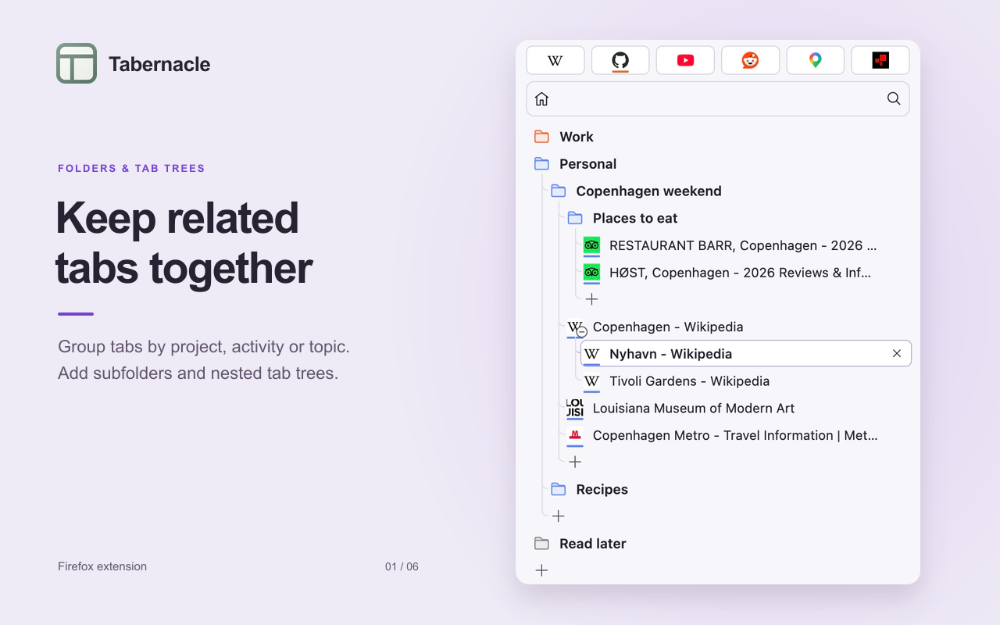
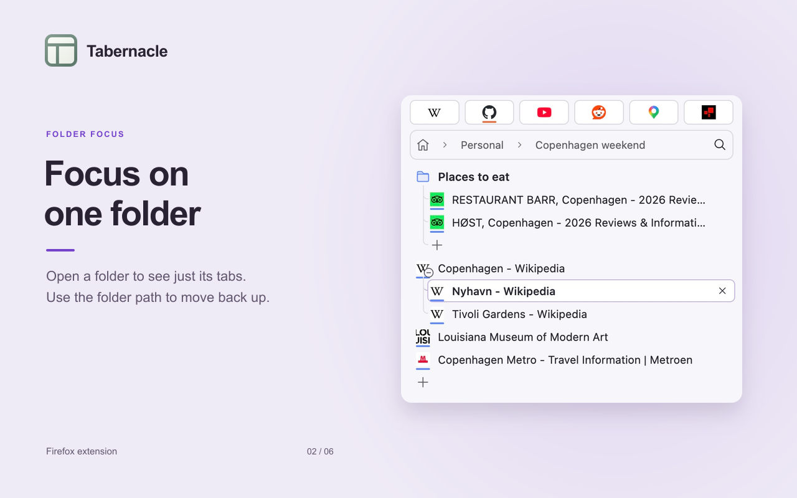
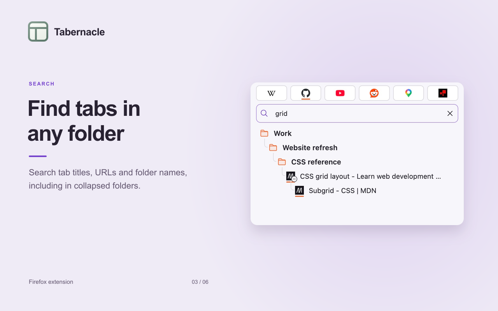
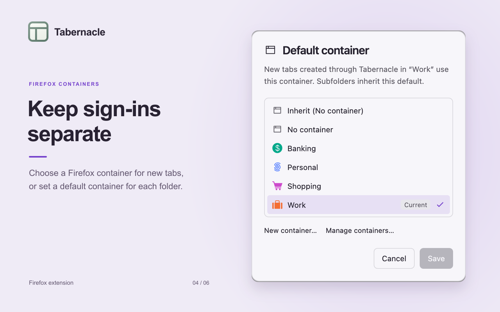
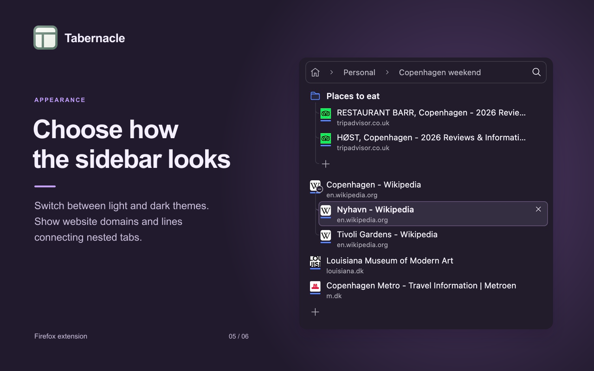
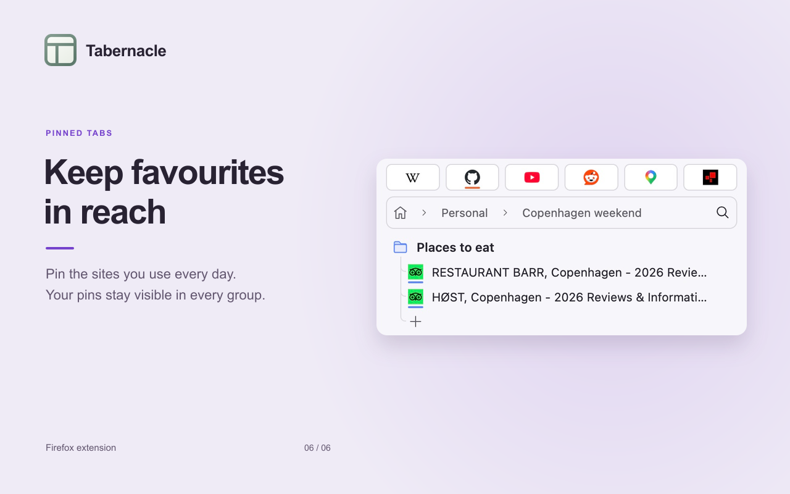

# Tabernacle

Tabernacle is a Firefox extension I made to help me navigate and organise my tabs. It adds a sidebar with groups, nested tab trees and search.

- Organise tabs into groups and subgroups, and focus on one group at a time.
- Keep related tabs in collapsible trees, with drag and drop to move or nest them.
- Search groups, tab titles and URLs.
- Use Firefox containers and set default containers for groups.
- Access pinned tabs, mute audio and reopen recently closed tabs.

Requires Firefox 142 or newer.

