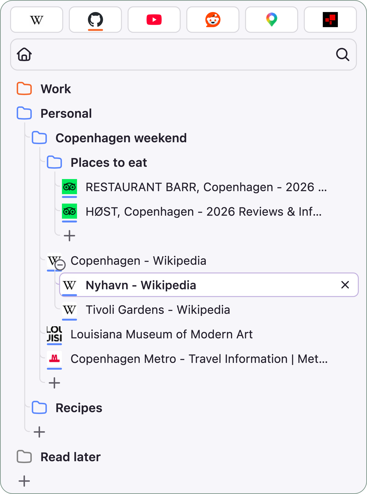
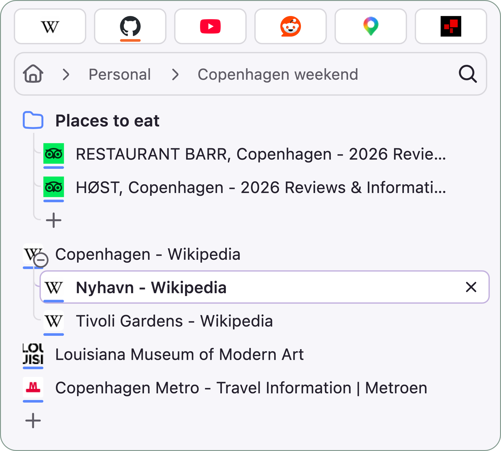
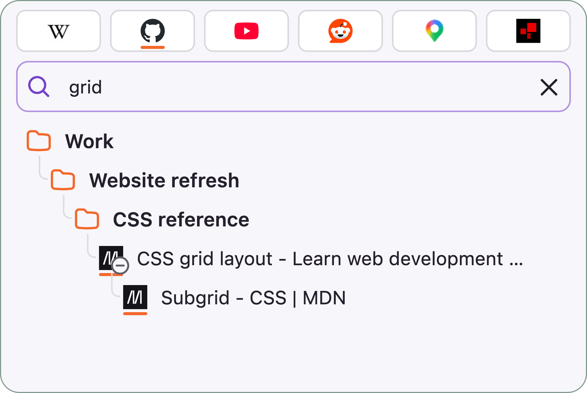
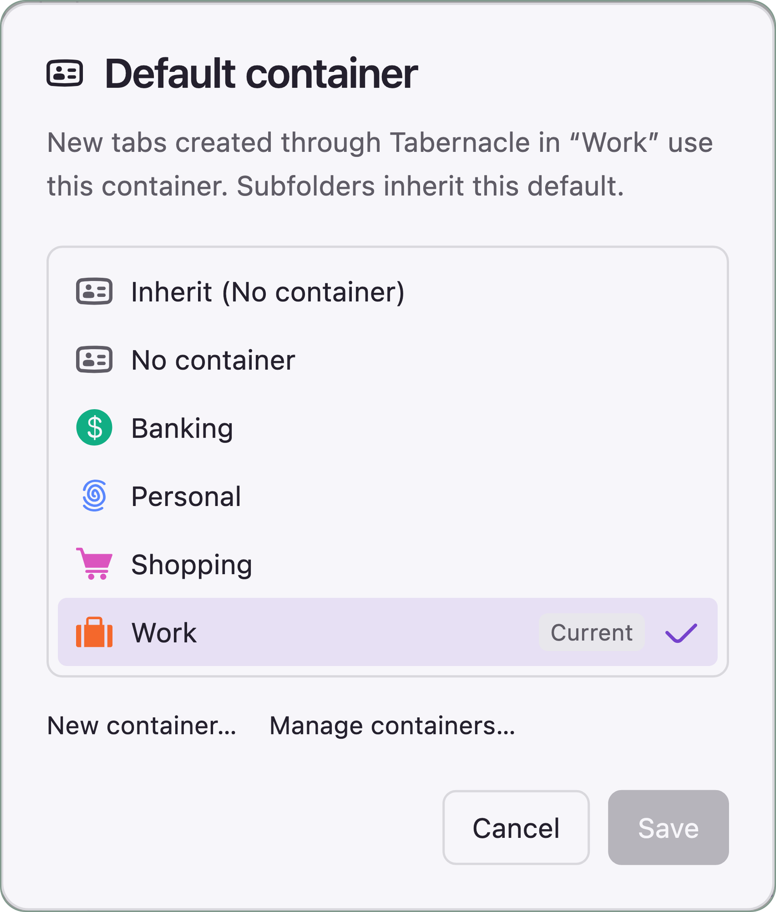
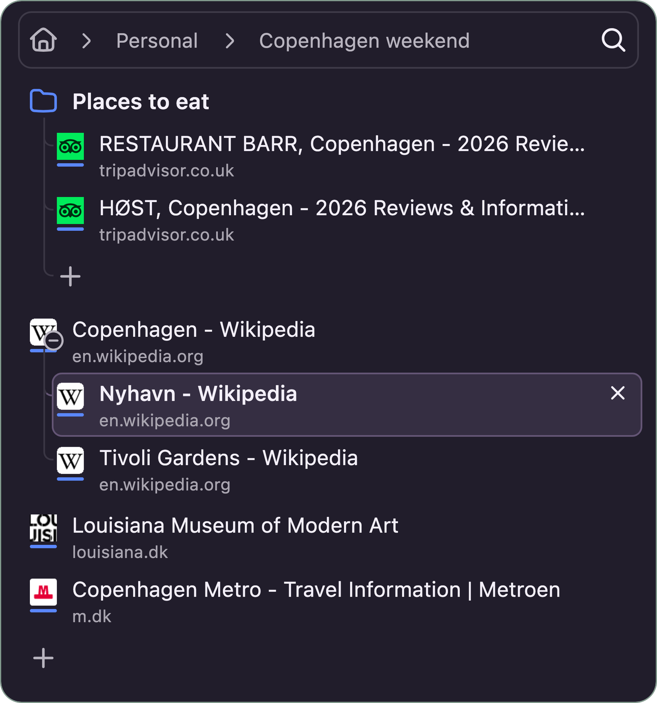
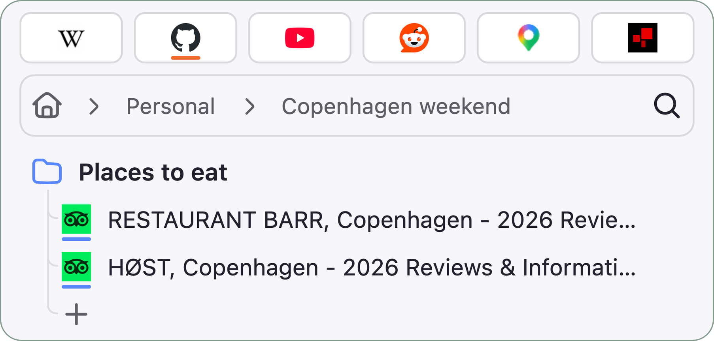

# Tabernacle

Tabernacle is a Firefox extension I made to help me navigate and organise my tabs. It adds a sidebar with folders, nested tab trees and search.

- Organise tabs into folders and subfolders, and focus on one folder at a time.
- Keep related tabs in collapsible trees, with drag and drop to move or nest them.
- Search folders, tab titles and URLs.
- Use Firefox containers and set default containers for folders.
- Access pinned tabs, mute audio and reopen recently closed tabs.

Requires Firefox 142 or newer.

## Keep related tabs together

Organise tabs into folders, subfolders and nested trees in your Firefox sidebar.

## Focus on one folder

Open a folder to see just its tabs. Use the folder path to move back up.

## Find tabs in any folder

Search tab titles, URLs and folder names, including in collapsed folders.

## Keep sign-ins separate

Choose a Firefox container for new tabs, or set a default container for each folder.

## Choose how the sidebar looks

Switch between light and dark themes. Show website domains and lines connecting nested tabs.

## Keep pinned tabs visible

Pin the sites you use most. They stay visible in every folder.

